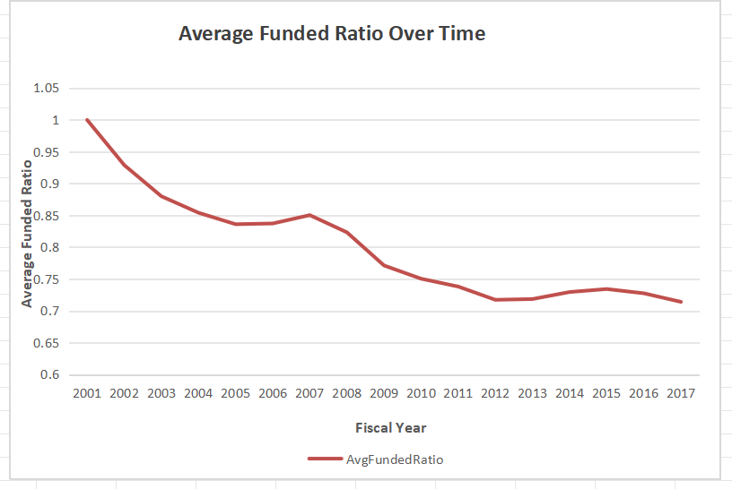
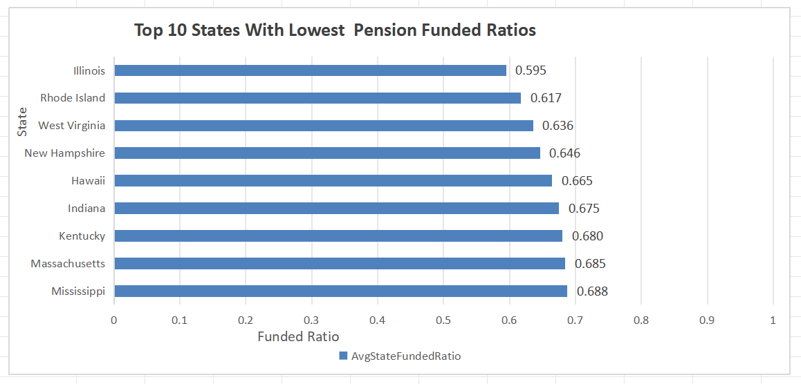
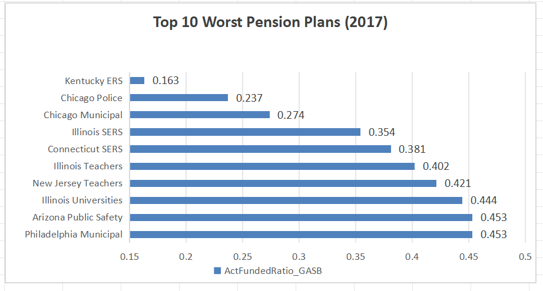
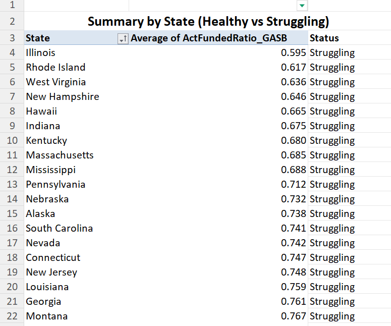
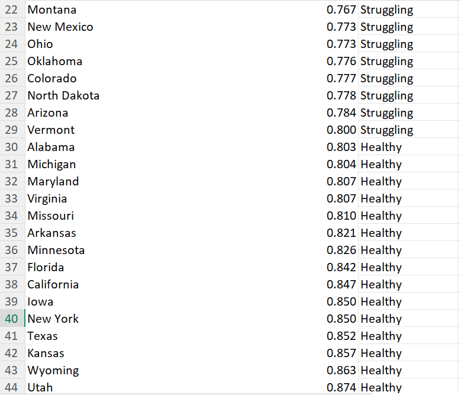
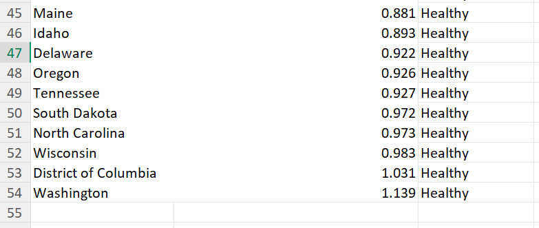

# Pension Fund Analysis

Analysis of U.S. pension fund health using SQL and Excel.

---

## Trend Over Time

This chart shows how the average funded ratio changed from 2001 to 2017.

- Funding was higher in earlier years  
- There is a clear downward trend  
- Pension systems are becoming less funded over time  

---

## Worst Performing States

This chart shows the states with the lowest funding levels.

- Many states are below 0.70  
- Illinois has the lowest funded ratio  
- These states may face financial challenges  

---

## Worst Pension Plans

This chart shows the most underfunded pension plans.

- Some plans have very low funding  
- This indicates serious financial risk  
- These plans may struggle to meet future obligations  

---

## Summary by State

  
  

This table classifies states as **Healthy** or **Struggling**.

- States below 0.80 are labeled "Struggling"  
- Many states fall into this category  
- Fewer states are financially stable  

---

## Tools Used

- Excel (Pivot Tables, Charts)  
- SQL (data querying and analysis)  

---

## Key Insight

Overall, pension funding has declined over time, and many states are underfunded.
